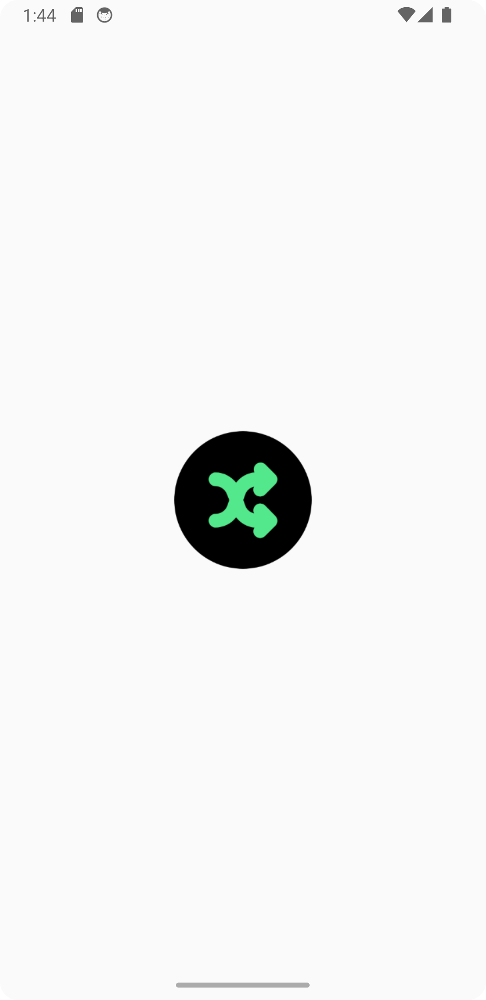
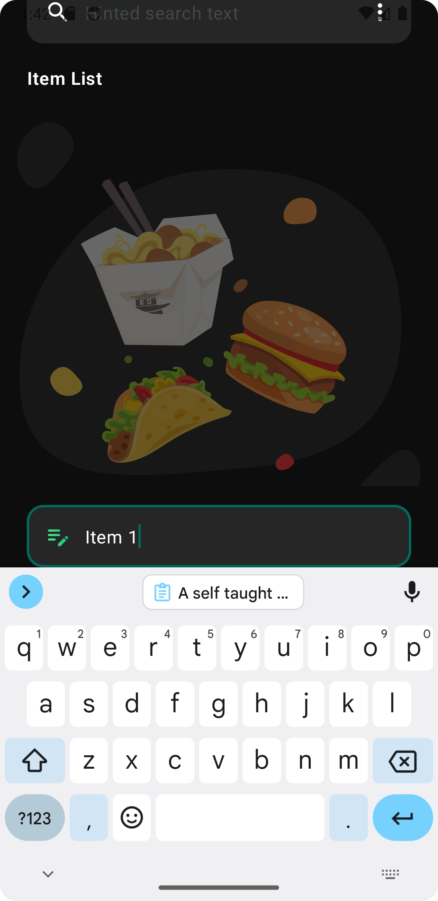

# Random-Picker-MVVM-Compose

  

A self taught personal project to create a simple random picker Android application with CRUD functions that can persists data to local database with best practices such as MVVM, Jetpack Compose and Dependency Injection.

# Libraries
1. <a href="https://github.com/objectbox/objectbox-java"><strong>ObjectBox</strong></a> : To persist data in local NoSQL database.
2. <a href="https://github.com/InsertKoinIO/koin"><strong>Koin</strong></a> : To handle dependancy injection.

# Screenshots

  
  &nbsp; &nbsp;
   
  &nbsp; &nbsp;
   
  &nbsp; &nbsp;
   
  &nbsp; &nbsp;
   
  &nbsp; &nbsp;
   
  &nbsp; &nbsp;

# Resources
- App Icon - [https://www.svgrepo.com/svg/466200/shuffle-circle]
- Banner Image - <a href="https://es.vecteezy.com/vectores-gratis/alternativas">Alternative Vectors by Vecteezy</a>
